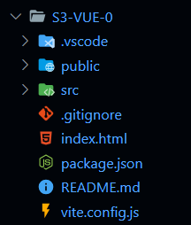

# VUE JS

Creación de un nuevo proyecto
```bash
    npm create vue@latest
    npm install -D tailwindcss postcss autoprefixer
    npx tailwindcss init -p
```

##### Estructra de archivos del proyecto 




#### Requerimientos
- Instalar la extensión Volar de Visual Studio Code
- VUE Dev Tools Extension
- VUE Tutorial https://vuejs.org/tutorial


### API de Opciones
 Se define la lógica utilizando un objeto de opciones como **data**, **methods** o **mounted**
 ````js
 <script>
export default {
  // Properties returned from data() become reactive state
  // and will be exposed on `this`.
  data() {
    return {
      count: 0
    }
  },

  // Methods are functions that mutate state and trigger updates.
  // They can be bound as event handlers in templates.
  methods: {
    increment() {
      this.count++
    }
  },

  // Lifecycle hooks are called at different stages
  // of a component's lifecycle.
  // This function will be called when the component is mounted.
  mounted() {
    console.log('The initial count is ${this.count}.')
  }
}
</script>

<template>
  <button @click="increment">Count is: {{ count }}</button>
</template>
 ````
   

### API de composición
(https://vuejs.org/guide/introduction.html#api-styles)

La lógica del componente se define utilizando funciones API iimportadas.
Se utiliza normalmente con ````<script setup>````.
````js
<script setup>
import { ref, onMounted } from 'vue'

// reactive state
const count = ref(0)

// functions that mutate state and trigger updates
function increment() {
  count.value++
}

// lifecycle hooks
onMounted(() => {
  console.log(`The initial count is ${count.value}.`)
})
</script>

<template>
  <button @click="increment">Count is: {{ count }}</button>
</template>
````

### Componente de archivo Único (SFC - Single-File Component)

Bloque reutilizable que encapsula HTML, CSS Y JavaScript dentro de un arhcivo **.vue**.

### Reactividad
Estados que desencadenan actualizaciones cuando se modifican.

####ref()
Forma recomendada estado reactivo.
**ref()** toma cualquier tipo de valor y devuelve un objeto **ref** con una propiedad **.value** 

````js
import { ref } from 'vue'

const mensaje = ref('Diplomado en DAOW!')

console.log(mensaje.value)
mensaje.value = 'Cambio del texto que almacena'
````
- Desde la plantilla (template) no es necesario llamar la propiedad value, basta con {{mensaje}}

Ver ejemplo en componente ***1-reactive.vue***

#### reactive()

Solo funciona en objetos (matrices, map y set), ya que lo hace reactivo. 
~~~js
import { reactive } from 'vue'
const state = reactive({ count: 0 })
~~~

### Vinculando atributos

